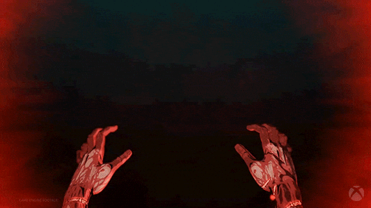

<div align="center">


> *"In this world, is the destiny of mankind controlled by some transcendental entity or law? Is it like the hand of God hovering above?"* ---

</div>

## ⚔️ What is This?

**BLOCKCHAIN** is not just another technical document. It’s a **Zero-to-One grimoire** designed for those who want a clear mental model before they touch a single line of code.

### ◈ Why This Book?
Most resources throw jargon at you. This book builds **intuition first**. 
By the time a professional like Patrick Collins asks, *"What is a block?"*, you won’t just have a definition—you’ll have a clear picture in your mind. You will understand the game before you even start playing it.

---

## 🧠 What You Will Master

After reading this book, you will be able to explain the "Unexplainable" to anyone:

* **The Foundation:** What a Block, Transaction, and Chain *actually* represent.
* **The Engine:** How Bitcoin and Ethereum function internally without a central heart.
* **The Mechanics:** Gas, Wallets, Mempools, and Consensus Mechanisms.
* **The Philosophy:** Why Decentralization is the only way forward.

---

## 🎯 Who is This For?

* 🧑‍💻 **Absolute Beginners:** If you know nothing, you are in the right place.
* ⚡ **The Curious:** You want to know what's going on in the shadows of Web3.

---

## 🛡️ Start Your Legend Now

Don't just read. **Execute.** The transition from theory to mastery happens here. Once you finish this book, your mind will be primed and ready. **Start your journey into the abyss now!**

👉 **[Cyfrin Updraft: Blockchain Foundations](https://updraft.cyfrin.io/career-tracks/blockchain-foundations)**

<div align="center">


</div>

---

## ⛓️ The Path to Unstoppable
Completing the Foundations course is just the beginning. Use the momentum from this book to dominate the next levels on **Cyfrin Updraft**:

1. **Smart Contract Developer:** Build protocols that can't be stopped.
2. **Security Auditor / Bug Hunter:** Find the cracks in the armor of others.
3. **Advanced Web3 Engineer:** Become a master of the metal.

<h2 align="center">START YOUR LEGENDARY WEB3 JOURNEY NOW!</h2>

<div align="center">
  
</div>

</div>


---

## 👤 Author: The Ghost in the System

```bash
$ whoami
> nxvjot7 — alias: Ghost
> Navjot Singh (hacker navjot)
```
---

<div align="center">

🔗 **[LinkedIn](https://www.linkedin.com/in/nxvjot7/)** | 🐙 **[GitHub](https://github.com/nxvjot7)**

<br/>

### 📜 License & Credits

This project is open for those who have the will to learn.

**Credits:** Inspiration from the Blockchain community and the dark world of Kentaro Miura's *Berserk*.

<br/>


</div>
